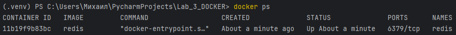
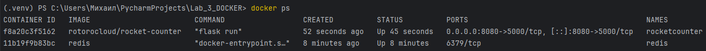
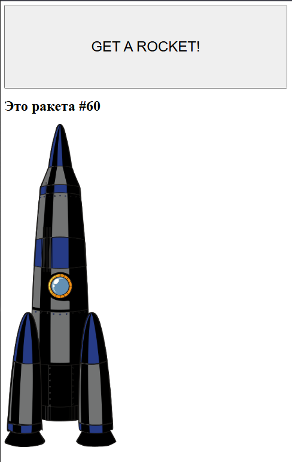
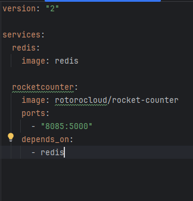
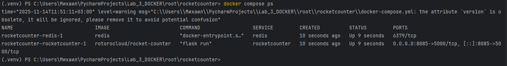
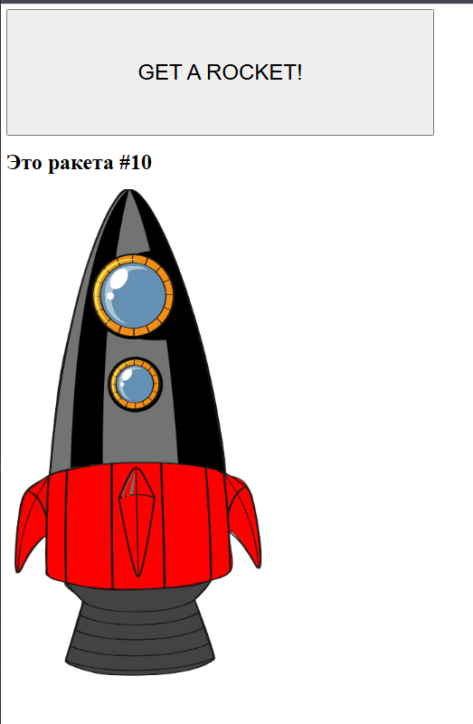
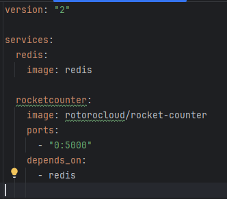
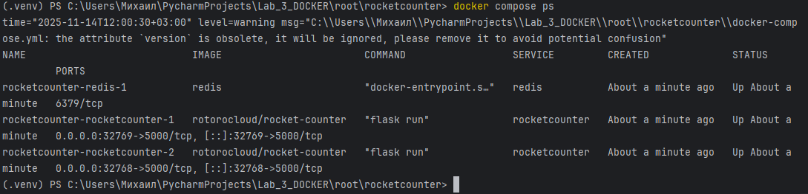
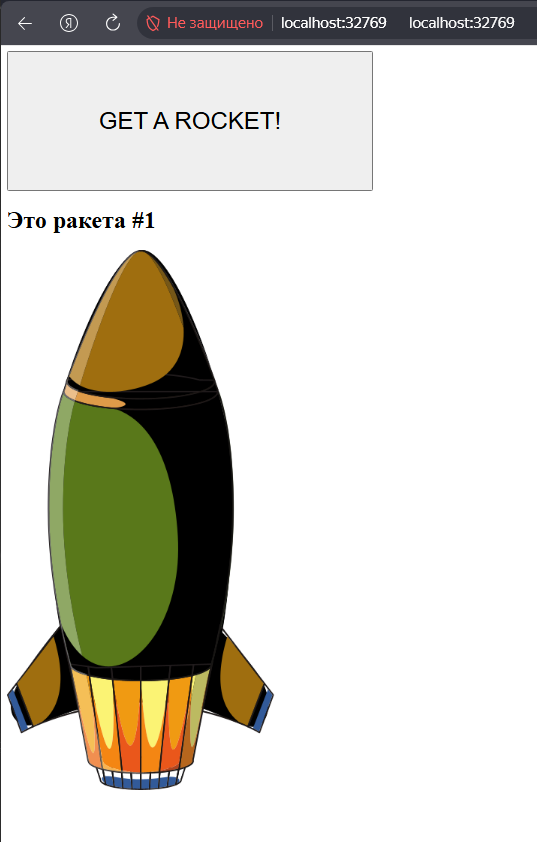
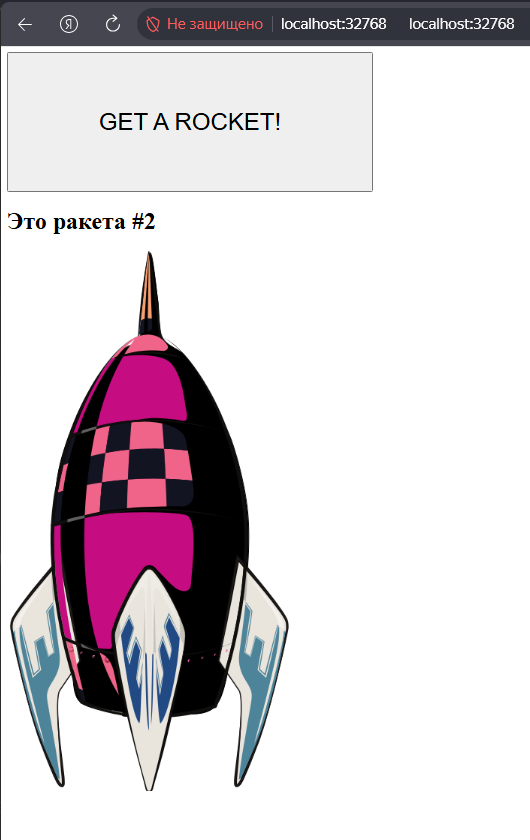

# Лабортаорная работа №3

## Часть 1. Запуск вручную

**1) Создание redis** 
Команда для создания и запуска redis:
```txt
docker run -d --name redis redis
```
Проверка: 
```txt
doscker ps
```


**2) Создание rocketcounter** 
```txt
docker run -d \
  --name rocketcounter \
  -p 8080:5000 \
  --link redis:redis \
  rotorocloud/rocket-counter
```
### Зачем --link и почему в Compose он не нужен?
### Как в Compose обеспечивается сетевое имя сервиса для обращения из другого сервиса?



Заходим на localhost:8080 и видим кнопку "Get a rocket". После клика 
появляется изображение ракеты и счетчик увеличивается.



**3) Удаление контейнеров** 

```txt
docker rm -f rocketcounter redis
```


## Часть 2. Запуск через docker compose

**1) Создание каталога /root/rocketcounter**

**2 Создание и настройка docker-compose.yml**


**3 Запсук стека и проверка**
```txt
docker compose up -d
docker compose ps
```


### Чем отличается image от build?


## Часть 3. Масштабирование приложения

**1) Остановка текущего стека**
```txt
docker compose down
```
**2) Меняем настройку docker-compose.yml**


**3) Запускаем с масштабированием и проверяем**
```txt
docker compose up -d --scale rocketcounter=2
docker compose ps
```



### 32768 - 60999
### Почему нельзя масштабировать сервис с публикацией фиксированного порта на одном хосте? Способы обхода


## Часть 4. Полное уничтожение стека

```txt
docker compose down -v
docker ps -a | Select-String -Pattern "redis|rocketcounter"
docker network ls | Select-String -Pattern "rocketcounter"
```
### Что делает `docker compose down -v` и что делает флаг -v?
